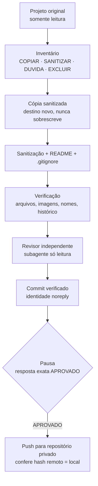

# publicar-projeto

Skill para o [Claude Code](https://claude.com/claude-code) que transforma um projeto local numa **cópia sanitizada para portfólio** e a publica no GitHub com segurança: varre segredos e dados pessoais, nunca toca no original, faz um commit verificado e só envia depois de uma aprovação explícita.

> **Os dados, IDs, nomes e configurações deste repositório são fictícios ou foram sanitizados. Nenhum dado real de clientes ou processos está incluído.** As listas de proteção (`termos-sensiveis.txt`, `termos-internos.txt`) vêm com exemplos fictícios para cada usuário preencher.

## Objetivo

Projetos feitos no dia a dia de trabalho costumam misturar código útil para portfólio com tokens, planilhas, nomes de clientes, caminhos da máquina e vocabulário interno da empresa. Limpar isso à mão é demorado e falha fácil — basta um `.env` esquecido ou um e-mail pessoal no histórico do Git.

O fluxo automatiza a preparação e deixa uma única decisão humana: aprovar o push.

```
/publicar-projeto "C:\caminho\do\projeto"
```

## Tecnologias

- Python 3.11+ (biblioteca padrão no núcleo: sqlite3, tkinter, hashlib, ctypes)
- Windows CNG (AES-256-GCM) e DPAPI, via ctypes, sem dependências externas
- Git e GitHub CLI (`gh`) para identidade, verificação do repositório e push
- Tesseract OCR (opcional) e PyMuPDF (opcional) para ler texto em imagens
- pytest para os testes
- Claude Code (skills, subagentes)

## Como funciona



Principais garantias:

- **Origem intacta:** o projeto original só é lido; tamanho e data de cada arquivo são conferidos no fim.
- **Classificação conservadora:** `.env`, chaves, certificados, bancos locais, logs, PDFs e planilhas nunca entram; o que é duvidoso só entra com aprovação.
- **Detecção ampla:** tokens e chaves de vários serviços, IDs privados, URLs internas, caminhos locais, dados pessoais brasileiros (CPF, CNPJ, número de processo, telefone, CEP, endereço, OAB), termos e vocabulário interno configuráveis, sem diferenciar maiúscula nem acento.
- **Nomes protegidos por hash:** uma lista grande de nomes (clientes, partes, empresas) pode ser guardada só como HMAC; a varredura compara as sequências de palavras do texto sem que o arquivo revele os nomes.
- **Cofre cifrado:** as listas reais (termos sensíveis, vocabulário interno, exceções) e a chave dos nomes protegidos ficam num SQLite com cada item cifrado em AES-256-GCM (Windows CNG) e chave de dados protegida pelo DPAPI do usuário; backup portátil com senha (scrypt + AES-256-GCM). Os avisos da varredura nunca mostram pedaço de nome ou termo, só a categoria e a linha.
- **App local do cofre:** janela (Tkinter) para ver e editar as listas com itens mascarados, revelação temporária, teste de nome na lista protegida e bloqueio por inatividade.
- **Imagens:** texto visível lido por OCR e metadados (EXIF, XMP, texto de PNG) detectados e removidos na cópia.
- **Exemplos sintéticos:** arquivos gerados pela própria skill são reconhecidos por hash, mas continuam sendo varridos.
- **Git:** histórico inteiro varrido (inclusive arquivos já apagados), identidade só no repositório com e-mail `noreply` do GitHub, commit apenas da lista verificada.
- **Push seguro:** só com a resposta exata `APROVADO`, só para repositório confirmado como privado pelo `gh`, sem force push.

## Estrutura

```
SKILL.md                     instruções da skill (fluxo em 13 passos)
config.json                  identidade Git e pasta de destino (placeholders)
revisor.md                   prompt do revisor independente
termos-sensiveis.txt         nomes bloqueados (exemplos fictícios)
termos-internos.txt          vocabulário interno bloqueado (exemplos fictícios)
nomes-permitidos.txt         exceções da lista de nomes protegidos
scripts/
  varrer.py                  inventário e verificação
  copiar.py                  cópia só do que foi liberado; confere a origem
  registrar_sinteticos.py    registra exemplos gerados
  nomes_protegidos.py        monta e consulta a lista de nomes por hash
  midia.py                   OCR e metadados de imagens
  git_publicar.py            identidade, commit, resumo da pausa e push
  cofre.py                   cofre cifrado: listas, segredos, migração e backup com senha
  app_cofre.py               app local para ver e editar o cofre
tests/                       testes com projetos fictícios em pasta temporária
Abrir cofre.cmd              abre o app do cofre
instalar.ps1                 instalador para Windows
INSTALAR.md                  guia de instalação
```

## Como executar

Pré-requisitos e passo a passo em [INSTALAR.md](INSTALAR.md). Resumo:

```bash
powershell -ExecutionPolicy Bypass -File .\instalar.ps1
```

Testes:

```bash
python -m pytest tests
```

Os testes criam projetos fictícios em pasta temporária e cobrem inventário, cópia, sanitização, verificação de imagens, nomes protegidos, histórico Git, identidade e o fluxo completo até o push num repositório local.

## Limitações

- OCR não reconhece rosto, assinatura, logotipo nem letra manuscrita; por isso imagens sempre exigem aprovação.
- Limpeza de metadados só para PNG e JPEG.
- O cofre usa DPAPI: protege contra outros usuários e acesso ao disco fora do Windows, não contra programa malicioso rodando no mesmo usuário. O cofre só abre no Windows.
- Sem login no `gh`, não é possível confirmar que um repositório é privado; nesse caso o push fica bloqueado.
- A generalização de regras internas no README depende de leitura humana e do revisor independente.

## Direitos autorais

Copyright © 2026 Samuel Rodrigues. Todos os direitos reservados.

O código e a documentação deste repositório são protegidos pela Lei nº 9.610/1998 (direitos autorais) e pela Lei nº 9.609/1998 (programa de computador). O uso, a cópia, a modificação ou a distribuição sem autorização prévia e por escrito do autor poderá ser objeto de notificação extrajudicial, de pedido de remoção junto ao GitHub (DMCA) e das medidas judiciais cabíveis.

Para pedir autorização, entre em contato pelo perfil do autor no GitHub.

## Uso

Este repositório é disponibilizado como portfólio e demonstração técnica.

Não é concedida permissão para copiar, modificar, distribuir ou reutilizar este código sem autorização do autor.
